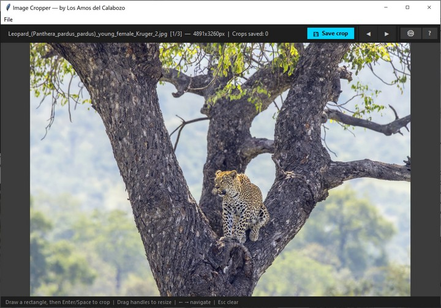

# 🖼️ Image Cropper

A lightweight desktop tool for quickly cropping regions from images. Built with Python and Tkinter — no installation wizard, no bloat.

*By Los Amos del Calabozo*

  

---

## Screenshot



---

## Features

- **Draw a crop selection** by clicking and dragging on the image
- **Resize** the selection with 8 handles (corners + edge midpoints)
- **Move** the selection by dragging inside it
- **Toolbar buttons** for Save, ◀ Prev, ▶ Next — all with keyboard shortcut tooltips on hover
- **Save crops** with the toolbar button, `Enter`, or `Space` — files are numbered automatically (`_cr1`, `_cr2`, …)
- **Navigate** between images in the same folder with the toolbar or keyboard
- **Remembers** the last opened file between sessions
- **Customisable** output folder and filename pattern via the ⚙ Settings dialog
- Rule-of-thirds grid overlay inside the selection

---

## Requirements

- Python 3.8+
- [Pillow](https://python-pillow.org/)

Install Pillow if you don't have it:

```bash
pip install Pillow
```

---

## Usage

```bash
python image_cropper.py
```

Or open a specific image directly:

```bash
python image_cropper.py /path/to/image.jpg
```

---

## Controls

All actions are available via toolbar buttons. Keyboard shortcuts also work:

| Action | Keyboard | Toolbar |
|---|---|---|
| Open image | `Ctrl+O` | `File > Open` |
| Draw selection | — | Click + drag |
| Resize selection | — | Drag any of the 8 handles |
| Move selection | — | Drag inside the selection |
| Clear selection | `Esc` | Click inside the selection |
| Save crop | `Enter` or `Space` | 💾 Save crop |
| Next image in folder | `→` | ▶ |
| Previous image in folder | `←` | ◀ |

---

## Output

Crops are saved according to your settings (configurable via the ⚙ button):

| Option | Description |
|---|---|
| Subfolder (default) | Saves into a named subfolder next to the source image (default: `cropped/`) |
| Same folder | Saves alongside the original image |
| Custom folder | Saves to any folder you choose |

### Filename pattern

The filename is controlled by a configurable pattern. Available placeholders:

| Placeholder | Meaning |
|---|---|
| `{base}` | Original filename without extension |
| `{n}` | Crop number (1, 2, 3, …) |
| `{ext}` | File extension (e.g. `.jpg`) |

**Default pattern:** `{base}_cr{n}`
**Example output:** `photo_cr1.jpg`, `photo_cr2.jpg`, …

---

## Settings & Config

Settings are saved automatically to:

- **Windows:** `C:\Users\<you>\.image_cropper.ini`
- **macOS / Linux:** `~/.image_cropper.ini`

You can edit this file directly or use the ⚙ Settings dialog in the app.

---

## Supported formats

`.jpg` `.jpeg` `.png` `.bmp` `.gif` `.tiff` `.webp`

---

## License

[CC0 1.0 Universal](https://creativecommons.org/publicdomain/zero/1.0/) — public domain. Do whatever you want with it.
